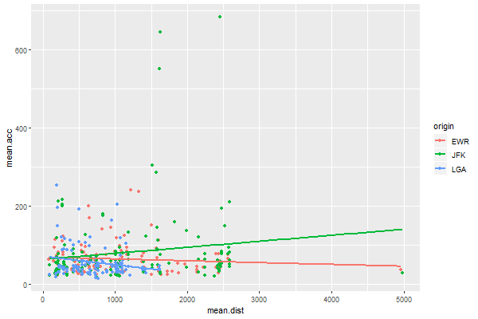

```{r , include=FALSE}
# This is a good place to put libraries required for using the ggplot function
knitr::opts_chunk$set(echo = TRUE)
options(scipen=999)
library(tidyverse)    #Loads the tidyverse suite of packages
library(nycflights13) #Contains Flight Data
library(knitr)        #kable() for HTML Tables
library(kableExtra)   #HTML Table Styling
```

# Introduction

The main purpose of this tutorial is to put together all 5 key functions from **[dplyr](https://dplyr.tidyverse.org/reference/index.html)** and use them to create summary tables and delightful graphs in RMarkdown. The functions and their purposes are listed as follows:

- `filter()` *Selects Observations Based on Values*

- `arrange()` *Sorts Observations Based on Criteria*

- `select()` or `rename()` *Selects, Deselects, Renames, and Reorders Variables*

- `mutate()` or `transmute()` *Creates New Variables Which Were Originally Nonexistant*

- `summarize()` *Aggregates the Data Based on Helpful Summary Statistics*

To further incite your anger towards the airline industry, we will continue to practice our skills using the dataset `flights` by loading the R package `nycflights13`. Until we learn how to fly, this dataset remains relevant.

> I'll spread my wings, and learn how to fly. I'll do what it takes till I touch the sky.
>
> -- <cite>Kelly Clarkson</cite>

# Part 1: Summarizing the Data (4 Points)

Using the pipe `%>%` to chain functions from `dplyr`, modify the code below to create a dataset named `flight.summary` that contains the following ordered modfications:

1. Starts with the raw dataset `flights` in the package `nycflights13`.

2. Transform delay variables so that they are measured in minutes since midnight, and then create a metric to measure accuracy based on those transformed delay variables. Use the geometric distance like seen in lecture.

3. Remove missing observations.

4. Group data based on combinations of "origin", "dest", and "carrier".

5. Summarize the data using the number of observations, the accuracy mean, the accuracy variance, and the mean distance for each combination of "origin", "dest", and "carrier". 

6. Filters summarized data to remove all combinations of "origin", "dest", and "carrier" with less than or equal to 10 flights throughout 2013.

7. Release the grouping constraint using the function `ungroup()`.

8. Create a variable called "proportion"" that represents the proportion of flights within each combination (with more than 10 flights).


```{r, eval=T}
flight.summary = 
  
  #1
  flights %>%
          
  #2
  mutate(
    dep_min       = (dep_time%/%100)*60+dep_time%%100,
    sched_dep_min = (sched_dep_time%/%100)*60+sched_dep_time%%100,
    arr_min       = (arr_time%/%100)*60+arr_time%%100,
    sched_arr_min = (sched_arr_time%/%100)*60+sched_arr_time%%100,
    dep_delay_min = dep_min-sched_dep_min,
    arr_delay_min = arr_min-sched_arr_min,
    accuracy      = sqrt(dep_delay_min * dep_delay_min + arr_delay_min * arr_delay_min)
  ) %>%
  
  #3
  filter(!is.na(accuracy)) %>%
  
  #4
  group_by(origin, dest, carrier) %>%

  #5
  summarize(
    count=n(),
    mean.acc=mean(accuracy),
    var.acc=var(accuracy),
    mean.dist=mean(distance)
  ) %>%
  
  #6
  filter(count > 10) %>%
  
  #7
  ungroup() %>%
  
  #8
  mutate(proportion = count / sum(count))

head(flight.summary) #DO NOT CHANGE THIS LINE OF CODE
```


# Part 2: Building Charts From Summary Data

### 2.1 (1 Point)

<center></center>

The purpose of creating this plot was to investigate if flight accuracy gets worse or better for longer flights. The chart above displays the approximated linear relationship between flight accuracy and flight distance for each the 3 NYC airports. This first image was created using a combination of `geom_point()` and `geom_smooth()`. Recreate this image using `ggplot()` and remember to modify the defaults of `geom_smooth()` to get linear trend lines without standard error regions. 

```{r,eval=F}
ggplot(data=flight.summary) +
  geom_point(mapping = aes(mean.dist, mean.acc, color = origin), size = 1)+
  geom_smooth(mapping = aes(mean.dist, mean.acc, color = origin), se = FALSE, method = "lm")
```

### 2.2 (1 Point)

The first thing we notice is that not many flights are over 3000 miles in distance. Design a new plot similar to the one above that ignores the scenarios where the distance exceeds 3000. This will prevent rare occurrences from effecting our linear trend comparison and present these relationships in a zoomed-in window where the majority of data exists.

```{r,eval=F}
ggplot(data=filter(flight.summary,mean.dist <= 3000)) +
  geom_point(mapping = aes(mean.dist, mean.acc, color = origin), size = 1)+
  geom_smooth(mapping = aes(mean.dist, mean.acc, color = origin), se = FALSE, method = "lm")
```

### 2.2 (1 Point)

Answer the following question using complete sentences: 

Each trend line is doing different things. Which of the three originating airports is doing the worst regarding the relationship between flight accuracy and flight distance? Explain why.

JFK is the airport that is doing the worst regarding the relationship between flight accuracy and flight distance. The metric we are using for accuracy is better the lower the value. High values of accuracy represent higher values of departure delay and arrival delay. From the graph above, we can clearly see JFK having the highest value for accuracy among the three airports. In fact, we also see the biggest outliers with values above 600 also for JFK. Moreover, the slope for JFK is positive, which shows that it performs worse for longer flights compared to LGA which as a negative slope showing it performs better for longer flights. 

# Part 3: Build a Nice Table to Be Displayed in RMarkdown (1 Point)

The dataset we created, `flight.summary`, summarizes the raw data but still contains 370 observations. Below I have provided code, that produces a dataset called `flight.summary2` that only contains the top 5 and bottom 5 combinations of "origin", "dest", and "carrier" based on mean accuracy. Closely examine this code and ensure that you understand what is happening here. Set `eval=T` to create `flight.summary2`. 

```{r,eval=T}
flight.summary2 = 
  flight.summary %>%
  mutate(rank=min_rank(mean.acc)) %>%
  filter(min_rank(mean.acc)<=5 | min_rank(desc(mean.acc))<=5) %>%
  arrange(rank)
```

The `kable()` function in the `knitr` package allows for creating HTML tables. For information about the `kable` package, click **[here](https://bookdown.org/yihui/rmarkdown-cookbook/kable.html)** Furthermore, the `kableExtra` package allows you to add beauty to those internet-ready tables. Click **[here](http://haozhu233.github.io/kableExtra/awesome_table_in_html.html)** for a helpful introduction. 

Once you understand the function of `kable()` and the modifications you can apply, start an R code chunk to place the information required to produce an HTML table of `flight.summary2`.

```{r}
knitr::kable(flight.summary2, format = "pipe",
             col.names = c("Origin", "Destination", "Carrier", "Count", "Mean Accuracy", "Variance Accuracy", "Mean Distance", "Proportion", "Rank"),
             align = "ccccccccc", 
             caption = "Summarizing results of Flight Accuracy",
             digits = 5)
```


# Part 4: Additional Questions (2 Points)

In this class you will be forced to analyze data you probably care very little about. *This is the part in the class where you begin to act like you care.* An important rule in this class is to "love thy data as thyself." Consider the `flights` data from both the view of the airline executive and the customer. Given what you know about the data, write two questions that you would want to answer that would influence how you buy airline tickets.

1) WRITE A QUESTION HERE THAT YOU COULD ANSWER FROM THE DATA YOU HAVE

Since I am international student from India, I frequently have to take long 20 hour flights with a connection in between. So the most important question that would influence how I buy my tickets is how accurate is the flight for longer flights and which airport has the most delays?

(I used to always prefer flying from EWR rather than JFK because I have had bad experiences with delays in JFK, including having to sleep over at the airport for one night. But, now I actually have statistical evidence to prove that EWR is better than JFK for delays.)

2) WRITE A QUESTION HERE THAT WOULD REQUIRE YOU TO GET ADDITIONAL INFORMATION AND HOW WOULD YOU GO ABOUT GETTING THAT INFORMATION OR WHERE COULD YOU GO TO GET THAT INFORMATION

How expensive are the flight tickets from different carriers? I would love to see a metric that would take into account the accuracy and expense for a flight; I don't mind if the flight is slightly less accurate if it saves me $200. Getting this additional information is hard because flight prices are dynamic and keep changing, but knowing an average price over a month and seeing the trends in price changes can be useful as well. This information could be gathered through web scraping google flights and capturing the prices of different flights. 


